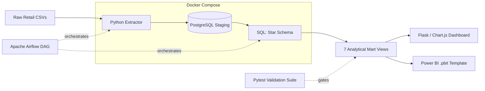

# Architecture — Retail Sales Analytics & Data Warehouse

## Diagram

## Layer Breakdown

| Layer | Responsibility |
|---|---|
| Extract | Python reads raw retail CSVs on an Airflow-triggered schedule |
| Load (Raw) | Raw rows land in a PostgreSQL staging schema, isolated from Airflow's metadata database |
| Transform | SQL builds the star schema, resolving lookup mapping errors and product description drift |
| Validate | pytest suite + SQL validation gates check row counts, nulls, referential integrity |
| Mart | 7 analytical mart views built on top of the validated star schema |
| Serve | Flask/Chart.js dashboard and Power BI template query the mart views directly |

## Data Model

| Table | Type | Grain | Description |
|---|---|---|---|
| dim_customer | Dimension | 1 row / customer | Customer attributes; telemetry gap flagged, not dropped |
| dim_product | Dimension | 1 row / product | Standardized product descriptions |
| fct_sales | Fact | 1 row / transaction line | Core sales facts joined to customer, product, date |
| mart_revenue_by_region | Mart View | Aggregated | One of 7 mart views built on `fct_sales` |

## Key Engineering Decisions
- **Separate PostgreSQL instances** for Airflow metadata vs. the retail warehouse, so orchestration state can never corrupt business data.
- **Fail-fast validation gates** halt the daily pipeline automatically rather than letting bad data reach a dashboard.
- **Docker Compose** packages the entire stack for single-command, reproducible deployment.
